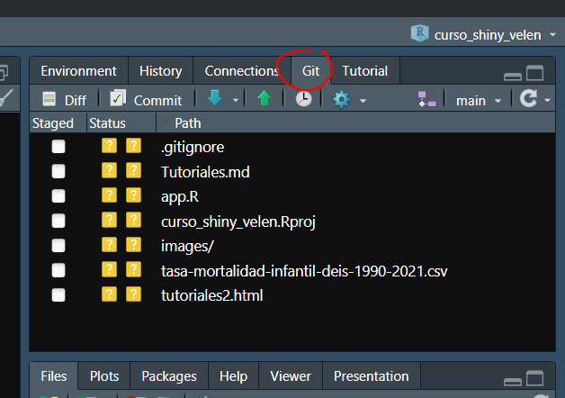
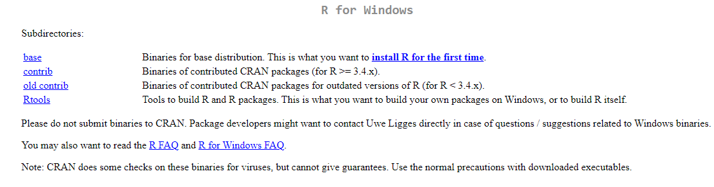
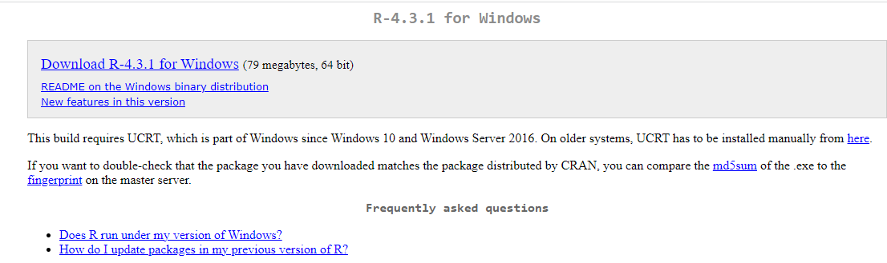
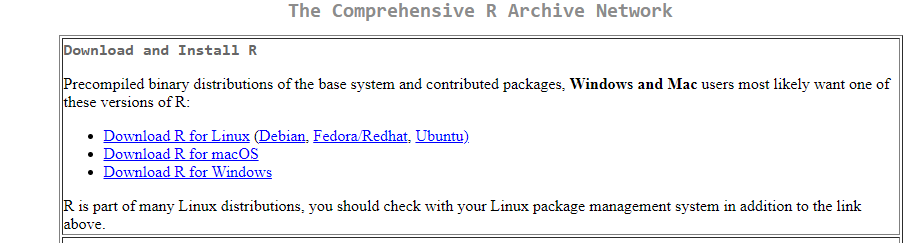
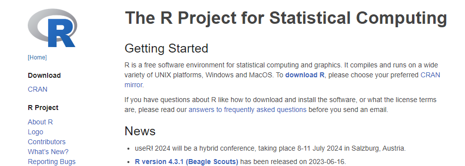

<!-- Output copied to clipboard! -->

<!-----

You have some errors, warnings, or alerts. If you are using reckless mode, turn it off to see inline alerts.
* ERRORs: 0
* WARNINGs: 0
* ALERTS: 6

Conversion time: 0.932 seconds.

Using this Markdown file:

1. Paste this output into your source file.
2. See the notes and action items below regarding this conversion run.
3. Check the rendered output (headings, lists, code blocks, tables) for proper
   formatting and use a linkchecker before you publish this page.

Conversion notes:

* Docs to Markdown version 1.0β34
* Thu Jul 20 2023 12:41:38 GMT-0700 (PDT)
* Source doc: Tutoriales RStudio y GIT
* This document has images: check for >>>>>  gd2md-html alert:  inline image link in generated source and store images to your server. NOTE: Images in exported zip file from Google Docs may not appear in  the same order as they do in your doc. Please check the images!

WARNING:
You have 5 H1 headings. You may want to use the "H1 -> H2" option to demote all headings by one level.

----->

>>>>>  gd2md-html alert:  ERRORs: 0; WARNINGs: 1; ALERTS: 6.

<ul style="color: red; font-weight: bold"><li>See top comment block for details on ERRORs and WARNINGs. <li>In the converted Markdown or HTML, search for inline alerts that start with >>>>>  gd2md-html alert:  for specific instances that need correction.</ul>

Links to alert messages:
<a href="#gdcalert1">alert1</a>
<a href="#gdcalert2">alert2</a>
<a href="#gdcalert3">alert3</a>
<a href="#gdcalert4">alert4</a>
<a href="#gdcalert5">alert5</a>
<a href="#gdcalert6">alert6</a>

>>>>> PLEASE check and correct alert issues and delete this message and the inline alerts.

>>>>>  gd2md-html alert: inline image link here (to images/image1.png). Store image on your image server and adjust path/filename/extension if necessary.  (<a href="#">Back to top</a>)(<a href="#gdcalert2">Next alert</a>) >>>>> 

# Tutoriales para instalación de RStudio y GIT

## Curso …. UNTREF

**─**

# Instalar R y RStudio:

Instalaciòn de R: Permite comprender el lenguaje de programación R

Instalación de RStudio: Se instala un entorno de desarrollo integrado (IDE) que facilita el uso de R. Es el IDE más usado para el lenguaje R. 

Enlace para descargar R:[ https://r-project.org](https://r-project.org)

>>>>>  gd2md-html alert: inline image link here (to images/image2.png). Store image on your image server and adjust path/filename/extension if necessary.  (<a href="#">Back to top</a>)(<a href="#gdcalert3">Next alert</a>) >>>>> 

>>>>>  gd2md-html alert: inline image link here (to images/image3.png). Store image on your image server and adjust path/filename/extension if necessary.  (<a href="#">Back to top</a>)(<a href="#gdcalert4">Next alert</a>) >>>>> 

>>>>>  gd2md-html alert: inline image link here (to images/image4.png). Store image on your image server and adjust path/filename/extension if necessary.  (<a href="#">Back to top</a>)(<a href="#gdcalert5">Next alert</a>) >>>>> 

>>>>>  gd2md-html alert: inline image link here (to images/image5.png). Store image on your image server and adjust path/filename/extension if necessary.  (<a href="#">Back to top</a>)(<a href="#gdcalert6">Next alert</a>) >>>>> 

>>>>>  gd2md-html alert: inline image link here (to images/image6.png). Store image on your image server and adjust path/filename/extension if necessary.  (<a href="#">Back to top</a>)(<a href="#gdcalert7">Next alert</a>) >>>>> 

Enlace para descargar RStudio: [https://rstudio.com](https://rstudio.com)

# Agenda

## Seguimiento de la última reunión

1. Inserta tu texto aquí, Inserta tu texto aquí. 

## Nuevos negocios

2. Inserta tu texto aquí, Inserta tu texto aquí. 
3. Inserta tu texto aquí. 

# Notas

* **Inserta tu texto aquí ** Inserta tu texto aquí. 
* **Inserta tu texto aquí ** Inserta tu texto aquí, Inserta tu texto aquí, Inserta tu texto aquí Inserta tu texto aquí. 
    * Inserta tu texto aquí.

# Elementos de acción

1. Inserta tu texto aquí. 

# Elementos de la agenda de la próxima reunión

Inserta tu texto aquí, Inserta tu texto aquí.

