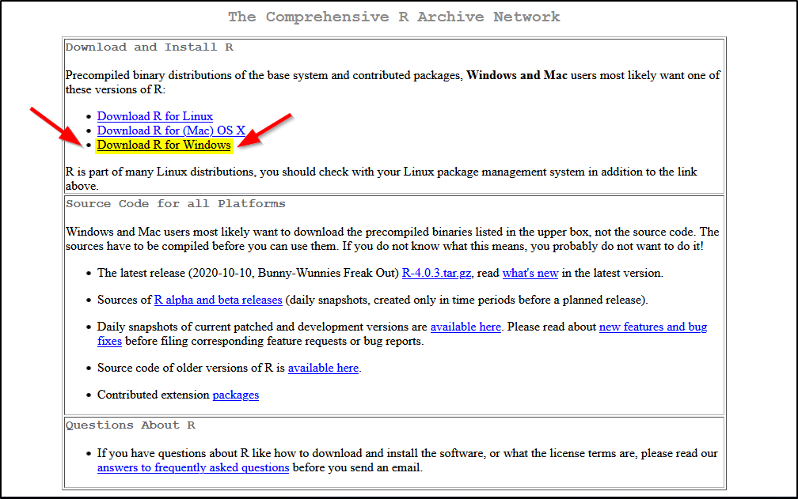

<!-----
NEW: Check the "Suppress top comment" option to remove this info from the output.

Conversion time: 3.025 seconds.

Using this Markdown file:

1. Paste this output into your source file.
2. See the notes and action items below regarding this conversion run.
3. Check the rendered output (headings, lists, code blocks, tables) for proper
   formatting and use a linkchecker before you publish this page.

Conversion notes:

* HTML and Markdown from Docs version 1.0
* Fri Jul 21 2023 04:03:43 GMT-0000 (UTC)
* Source doc: Tutoriales RStudio y GIT
* This document has images: check for >>>>>  gd2md-html alert:  inline image link in generated source and store images to your server. NOTE: Images in exported zip file from Google Docs may not appear in  the same order as they do in your doc. Please check the images!

WARNING:
You have 2 H1 headings. You may want to use the "H1 -> H2" option to demote all headings by one level.

----->

>>>>>  gd2md-html alert:  ERRORs: 0; WARNINGs: 1; ALERTS: 17.

<ul style="color: red; font-weight: bold"><li>See top comment block for details on ERRORs and WARNINGs. <li>In the converted Markdown or HTML, search for inline alerts that start with >>>>>  gd2md-html alert:  for specific instances that need correction.</ul>

Links to alert messages:
<a href="#gdcalert1">alert1</a>
<a href="#gdcalert2">alert2</a>
<a href="#gdcalert3">alert3</a>
<a href="#gdcalert4">alert4</a>
<a href="#gdcalert5">alert5</a>
<a href="#gdcalert6">alert6</a>
<a href="#gdcalert7">alert7</a>
<a href="#gdcalert8">alert8</a>
<a href="#gdcalert9">alert9</a>
<a href="#gdcalert10">alert10</a>
<a href="#gdcalert11">alert11</a>
<a href="#gdcalert12">alert12</a>
<a href="#gdcalert13">alert13</a>
<a href="#gdcalert14">alert14</a>
<a href="#gdcalert15">alert15</a>
<a href="#gdcalert16">alert16</a>
<a href="#gdcalert17">alert17</a>

>>>>> PLEASE check and correct alert issues and delete this message and the inline alerts.

>>>>>  gd2md-html alert: inline image link here (to images/image1.png). Store image on your image server and adjust path/filename/extension if necessary.  (<a href="#">Back to top</a>)(<a href="#gdcalert2">Next alert</a>) >>>>> 

# Tutoriales para instalación de RStudio y GIT y su integración

## Introducción al procesamiento, análisis y visualización interactiva de datos abiertos en salud -  UNTREF

**─**

# Instalar R y RStudio:

Instalaciòn de R: Permite comprender el lenguaje de programación R

Instalación de RStudio: Se instala un entorno de desarrollo integrado (IDE) que facilita el uso de R. Es el IDE más usado para el lenguaje R. 

Para instalar R ingresa [aca](https://cloud.r-project.org/) y sigue las instrucciones:

>>>>>  gd2md-html alert: inline image link here (to images/image2.png). Store image on your image server and adjust path/filename/extension if necessary.  (<a href="#">Back to top</a>)(<a href="#gdcalert3">Next alert</a>) >>>>> 

>>>>>  gd2md-html alert: inline image link here (to images/image3.png). Store image on your image server and adjust path/filename/extension if necessary.  (<a href="#">Back to top</a>)(<a href="#gdcalert4">Next alert</a>) >>>>> 

>>>>>  gd2md-html alert: inline image link here (to images/image4.png). Store image on your image server and adjust path/filename/extension if necessary.  (<a href="#">Back to top</a>)(<a href="#gdcalert5">Next alert</a>) >>>>> 

Una vez instalado R, pueden instalar RStudio:

RStudio es un entorno integrado de desarrollo (IDE por sus siglas en inglés). Si bien, podemos utilizar R directamente desde documentos de texto plano, se recomienda instalar y usar un IDE, ya que es una manera más práctica para trabajar y desarrollar nuestros proyectos. Esto se debe a que nos facilitará tareas como administrar los archivos con los que trabajamos, emplear herramientas para escribir y revisar nuestro código, efectuar capacidades gráficas, así como fluidez para trabajar en el entorno local de nuestro ordenador.

Ingresa al sitio oficial de [RStudio](https://rstudio.com/products/rstudio/download/).

>>>>>  gd2md-html alert: inline image link here (to images/image5.png). Store image on your image server and adjust path/filename/extension if necessary.  (<a href="#">Back to top</a>)(<a href="#gdcalert6">Next alert</a>) >>>>> 

# Integrar GIT con R y Rstudio

R en combinación con el sistema de control de versiones distribuidas Git ofrece una configuración conveniente para hacer que su proyecto de investigación sea reproducible. Git le permite rastrear y compartir su código y análisis de manera eficiente.

Algunas razones para utilizar GIT y GitHub son:

* Facilita el compartir sus proyectos de forma sencilla una vez que estén configurados correctamente.
* Favorece la colaboración, permitiendo a otras personas contribuir a su proyecto y viceversa. Además, pueden reportar errores o sugerir nuevas incorporaciones al proyecto.
* Le permite volver a versiones anteriores en caso de encontrar errores o eliminar algo accidentalmente.
* Permite visualizar los cambios entre diferentes versiones de su código, análisis o texto escrito.

**GitHub **es un servicio web fácil de usar que le permite almacenar el repositorio de su proyecto de forma remota. Otras alternativas son GitLab y Bitbucket.

RStudio integra soporte para Git, por lo que utilizaremos la combinación ampliamente utilizada R + Git + RStudio para el control de versiones y desarrollo colaborativo de proyectos.

1. Instalar Git

Desde el siguiente enlace: [https://git-scm.com/downloads](https://git-scm.com/downloads)

2. Crear cuenta de GitHub

Crear su cuenta desde el siguiente enlace [https://github.com/ ](https://github.com/)

3. Configure Git en RStudio: 

Indique a RStudio dónde encontrar la instalación de Git. Para ello sigue los siguientes pasos:

1. Abra RStudio y vaya a Herramientas > Opciones globales… haga clic en Git/SVN
2. Marque Habilitar interfaz de control de versiones para proyectos de RStudio
3. Establezca la ruta al ejecutable de Git que acaba de instalar. Pruede ayudarse del boton “Broese..” para llegar a la ruta. En la imagen un ejemplo de ruta.
4. Reinicie RStudio. Si funcionó, encontrará el icono de Git en la barra de herramientas superior, como se muestra a continuación.

## 
    

>>>>>  gd2md-html alert: inline image link here (to images/image6.png). Store image on your image server and adjust path/filename/extension if necessary.  (<a href="#">Back to top</a>)(<a href="#gdcalert7">Next alert</a>) >>>>> 

4. Configure Git: 

    En la consola de RStudio escribir

        	library(usethis)

        	edit_git_config()

    Luego verán que se crea una ventana llamada “.gitconfig” y alli deberán completar los campos _name_ y _email_ tal como se ve en la figura y guardar. 

    

>>>>>  gd2md-html alert: inline image link here (to images/image7.png). Store image on your image server and adjust path/filename/extension if necessary.  (<a href="#">Back to top</a>)(<a href="#gdcalert8">Next alert</a>) >>>>> 

 

5. Crear un repositorio propio en GitHub
    1. Ingresar a la pagina de GitHub y crear un repositorio nuevo que se llame “curso_shiny_sunombre” agregandole su nombre al final. Al hacer clic en “new” se abrirá una pantalla como la que está a continuación.

    

>>>>>  gd2md-html alert: inline image link here (to images/image8.png). Store image on your image server and adjust path/filename/extension if necessary.  (<a href="#">Back to top</a>)(<a href="#gdcalert9">Next alert</a>) >>>>> 

    

>>>>>  gd2md-html alert: inline image link here (to images/image9.png). Store image on your image server and adjust path/filename/extension if necessary.  (<a href="#">Back to top</a>)(<a href="#gdcalert10">Next alert</a>) >>>>> 

    2. Ahora, increse al repositorio y copie el enlace, tal como se muestra en la captura.

        

>>>>>  gd2md-html alert: inline image link here (to images/image10.png). Store image on your image server and adjust path/filename/extension if necessary.  (<a href="#">Back to top</a>)(<a href="#gdcalert11">Next alert</a>) >>>>> 

6. Clonar un repositorio, o conectar un proyecto con un repositorio GitHub
1. Ir al repositorio que desea clonar. En este caso, el del curso es: 

        [https://github.com/velenp/curso_shiny](https://github.com/velenp/curso_shiny)

        Haga clic en el boton verde que dice “code” y se desplegará una ventana, donde puede copiar el enlace del repositorio, o también puede descargar el .ZIP. En este caso vamos a descargar el .ZIP. Si usted desea conectarse para trabajar colaborativamente con ese repositorio puede copiar el enlace y clonarlo desde RStudio. Hay que tener en cuenta que para que esto sea posible el repositorio debe estar compartido con su usuario, de lo contrario no podrá trabajar colaborativamente. 

        En este caso, lo que vamos a hacer es clonar el repositorio vacio que ustedes crearon y a ese repositorio del que ustedes son propietarios subirles los materiales que se descargaron desde aqui en un .ZIP.

        

>>>>>  gd2md-html alert: inline image link here (to images/image11.png). Store image on your image server and adjust path/filename/extension if necessary.  (<a href="#">Back to top</a>)(<a href="#gdcalert12">Next alert</a>) >>>>> 

2. En RStudio, en el margen superior derecho, ir a “nuevo proyecto” o “New Project”.
3. En la pantalla que se abre seleccione la opción “Version Control” tal como se ve en la captura a continuación.

        

>>>>>  gd2md-html alert: inline image link here (to images/image12.png). Store image on your image server and adjust path/filename/extension if necessary.  (<a href="#">Back to top</a>)(<a href="#gdcalert13">Next alert</a>) >>>>> 

    Seleccione la opción GIT

        

>>>>>  gd2md-html alert: inline image link here (to images/image13.png). Store image on your image server and adjust path/filename/extension if necessary.  (<a href="#">Back to top</a>)(<a href="#gdcalert14">Next alert</a>) >>>>> 

    Ingrese la URL del repositorio que tiene su nombre, que crearon en el paso 5, seleccione la carpeta donde lo quiere alojar y ponga crear proyecto.

        

>>>>>  gd2md-html alert: inline image link here (to images/image14.png). Store image on your image server and adjust path/filename/extension if necessary.  (<a href="#">Back to top</a>)(<a href="#gdcalert15">Next alert</a>) >>>>> 

7. Agregar archivos a su repositorio y realizar un commit
1. En su computadora, ahora encontrará una carpeta llamada “curso_shiny_nombre” con el contenido del curso. En esta carpeta deberan pegar el contenido de la carpeta del archivo.ZIP. Importante: no reemplazar archivos y eliminar el archivo “curso_shiny.Rproj” de modo que quede un solo archivo con extensión .Rproj en la carpeta, y este tenga su nombre.
2. Si vuelve a RStudio, veran en la ventada GIT, que se encuentra como solapa en el mismo espacio que el Environment, todos estos archivos nuevos agregados. 

        

>>>>>  gd2md-html alert: inline image link here (to images/image15.png). Store image on your image server and adjust path/filename/extension if necessary.  (<a href="#">Back to top</a>)(<a href="#gdcalert16">Next alert</a>) >>>>> 

3. Estos archivos se encuentran guardados localmente. Si quieren subirlos a su repositorio de GitHub deberá hacer un “commit” y luego “Push”. Veamos el paso a paso:
4. Hacer clic en Commit, y verán que se despliega una ventana como la presentada a continuación. Alli, tildar todos los archivos tal como se ve en la captura. Donde dice “commit message” poner un mensaje que identifique a este commit, como por ejemplo “primer commit”. y por ultimo hacer clic en “commit” que se muestra en la figura señalado en rojo.

        

>>>>>  gd2md-html alert: inline image link here (to images/image16.png). Store image on your image server and adjust path/filename/extension if necessary.  (<a href="#">Back to top</a>)(<a href="#gdcalert17">Next alert</a>) >>>>> 

5. Aparecerá una ventana negra con el detalle de la tarea realizada. Cerra esa ventana y hacer clic en el botón de “push” con una flecha verde hacia arriba, tal como se muestra en la captura.

        

>>>>>  gd2md-html alert: inline image link here (to images/image17.png). Store image on your image server and adjust path/filename/extension if necessary.  (<a href="#">Back to top</a>)(<a href="#gdcalert18">Next alert</a>) >>>>> 

6. Ahora, si ingresan al su repositorio desde la pagina de GitHub veran que contiene los archivos que subieron. Cada vez que modifiquen alguno de estos archivos o agreguen un archivo nuevo deberán repetir el proceso de “Commit” y luego “Push” para actualizar su repositorio de GitHub. En texto que pongan en “commit message” será una referencia al momento de revisar el historial de cambios que tuvo el repositorio.
7. En caso que estén trabajando con un repositorio de forma colaborativa, con otras personas, es necesario, que antes de realizar cada “commit” y “push” presionen el botón de la flecha celeste hacia abajo que dice “Pull”. De este modo podrán incorporar los cambios que realizó otro colaborador en su proyecto. En importante realizar el “Pull” antes que el “Push” para evitar conflictos entre versiones.  Si varios colaboradores están trabajando en el mismo proyecto y realizan cambios en la misma parte del código, un "pull request" permite resolver posibles conflictos antes de que se mezclen los cambios. Esto evita que los cambios se fusionen con conflictos no resueltos, lo que podría llevar a errores en el código.

         
